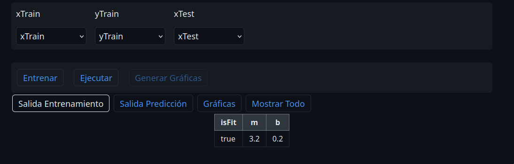
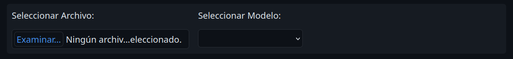
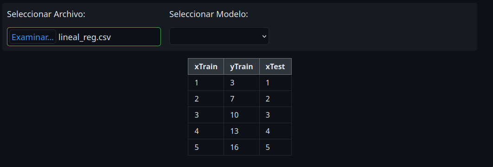
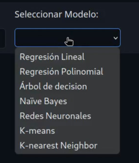
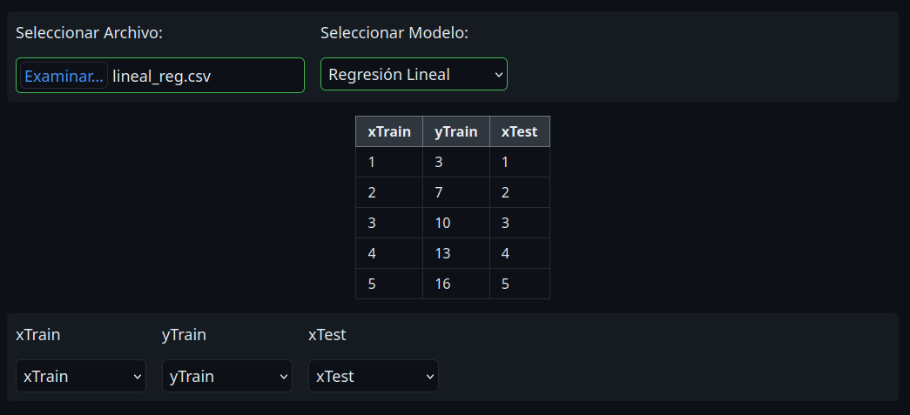
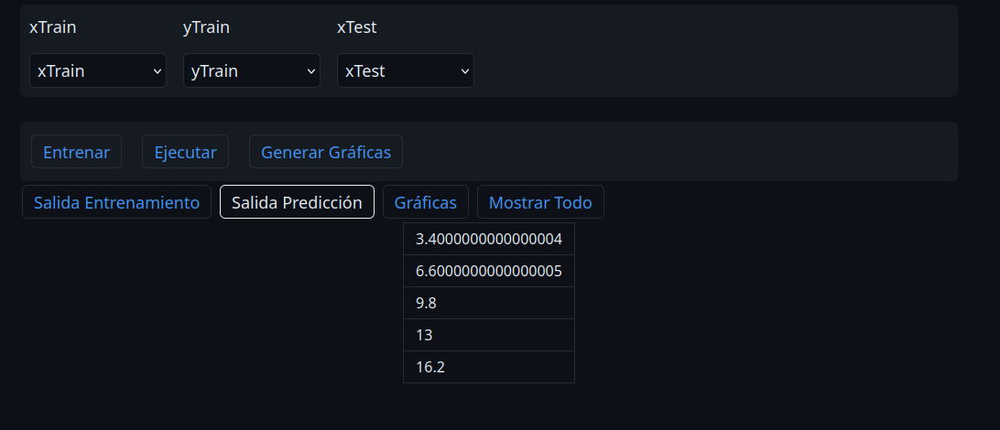
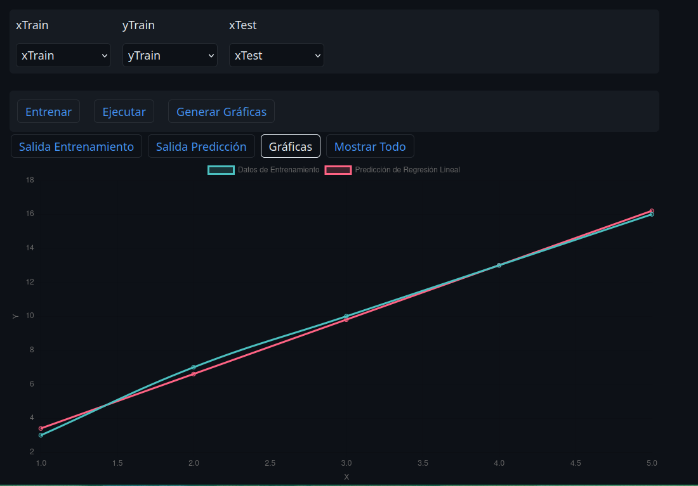
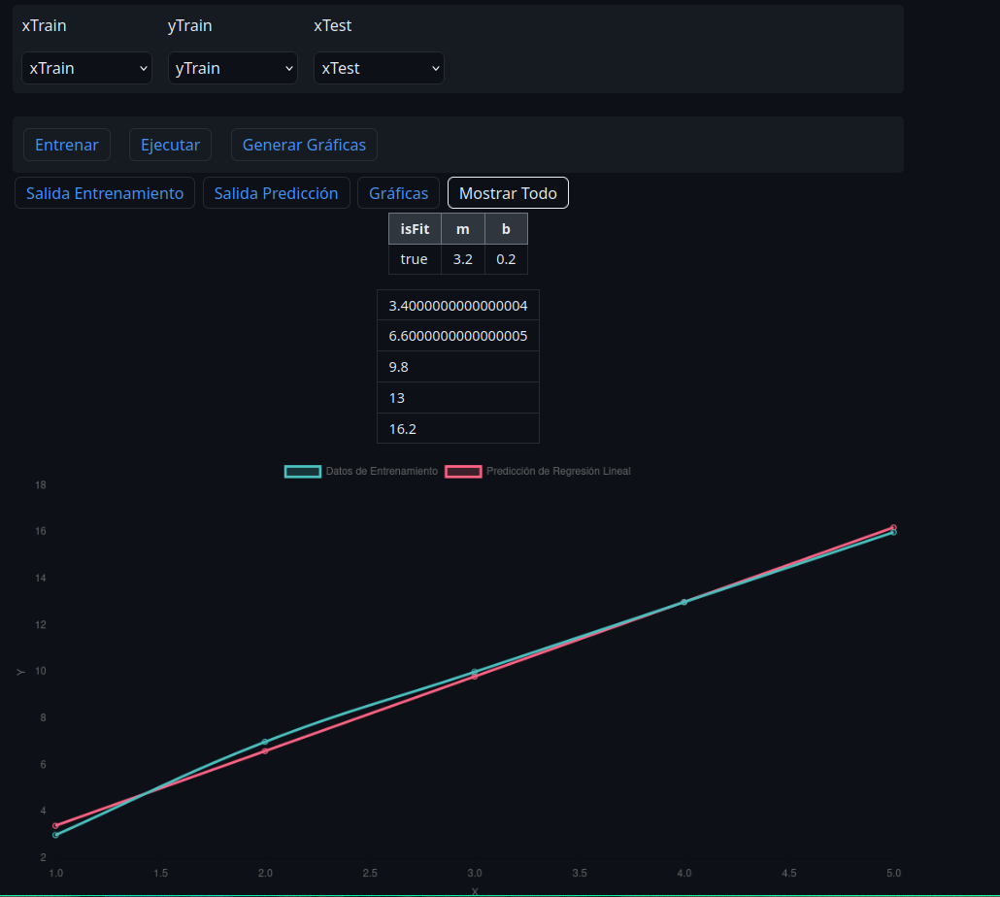

# Manual de Usuario

## Tabla de Contenidos
- [Introducción](#introducción)
- [Requisitos](#requisitos)
- [Navegación de la Interfaz](#navegación-de-la-interfaz)
- [Flujo de Trabajo](#flujo-de-trabajo)
   - [Carga de Datos](#carga-de-datos)
   - [Selección del Modelo](#selección-del-modelo)
   - [Ejecución y Resultados](#ejecución-y-resultados)

---

## Introducción

Esta sección ofrece una visión general de la aplicación, su propósito y los tipos de usuarios que pueden beneficiarse de ella. Describa brevemente los modelos de machine learning disponibles y los tipos de problemas que cada uno puede resolver (por ejemplo, regresión, clasificación, clustering).

## Requisitos

- Navegador de internet (Firefox, Chrome y variantes).
- Conexión a Internet para cargar las bibliotecas externas.

## Navegación de la Interfaz

    

## Flujo de Trabajo

### Carga de Datos

En el formulario inicial existe un campo para subir un archivo



Al cargar el CSV se espera que está tenga un formato de datos separados por comas, y filas separadas por lineas: 

```
Encabezado1,Encabezado2
Dato1,Dato2
Dato3,Dato4
Dato5,Dato6
```

Si la carga es correcta los datos se mostrarán en formato de tabla en la interfaz.




### Selección del Modelo

En el menú desplegable se puede seleccionar el modelo de Machine Learning a utilizar. 



Al ser seleccionado se mostrará el menú de configuración para el entrenamiento y ejecución del modelo. Las opciones del menú varian según el modelo




### Ejecución y Resultados

Una vez seleccionados los parametros a utilizar en el modelo, podemos ejecutar el entrenamiento de este mismo dando click al botón `Entrenar`. 

Cuando se haya llevado a cabo el entrenamiento se nos mostrará sus resultado en un menú de pestañas que podemos navegar. También se habilitará el botón de Ejecutar para ejecutar la predicción u operación del modelo.


Al ejecutar el modelo se mostrará su resultado, de diferente forma dependiendo del modelo. También se habilitará el botón `Generar Gráficas`



Al generar las gráficas se generará una gráfica para mostrar de forma gráfica los resultados relevantes del modelo. Puden ser gráficas, medidores o árboles dependiendo del modelo.



También está la pestaña `Mostrar Todo` que muestra todos los resultados previos.


